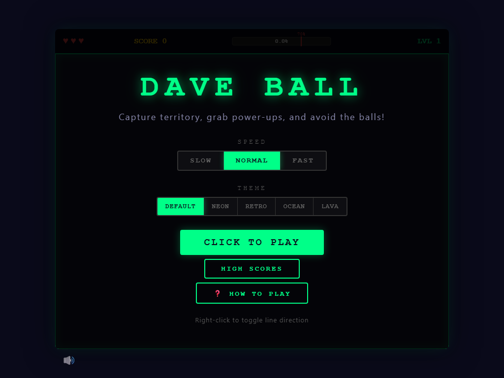
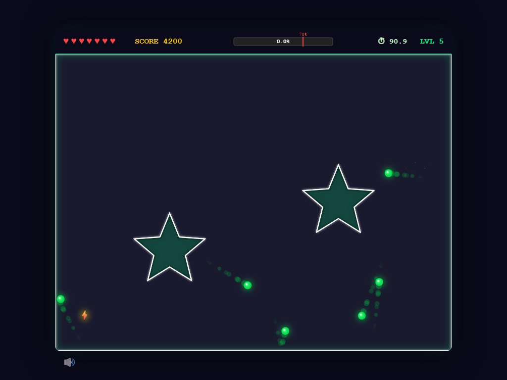
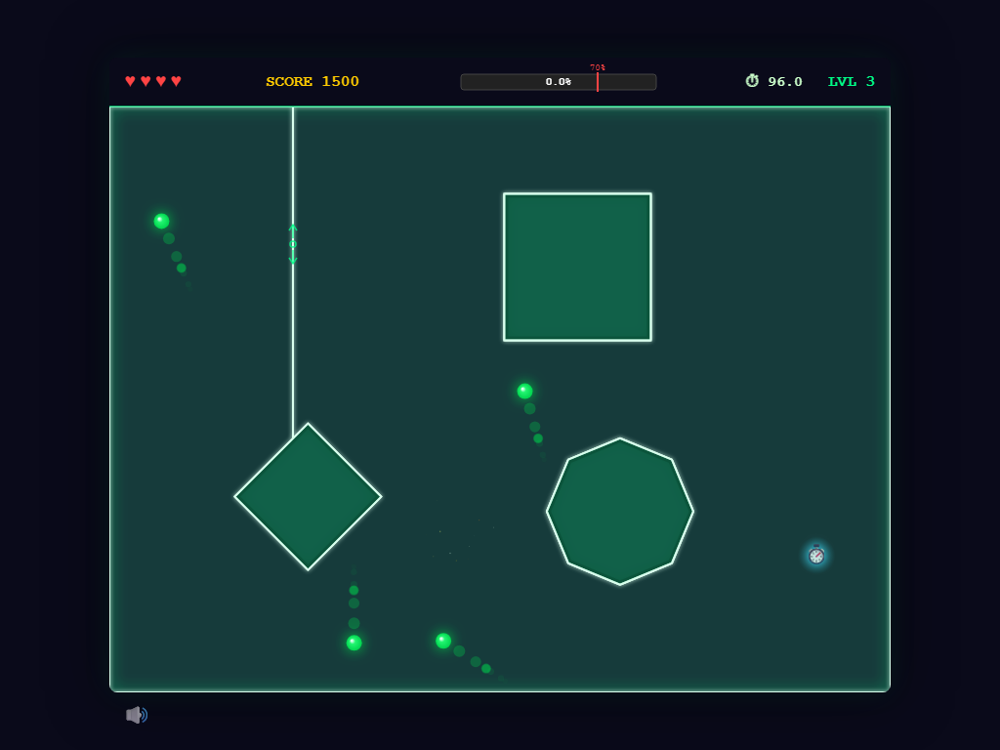
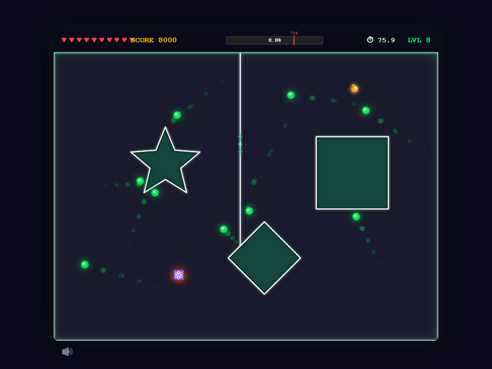
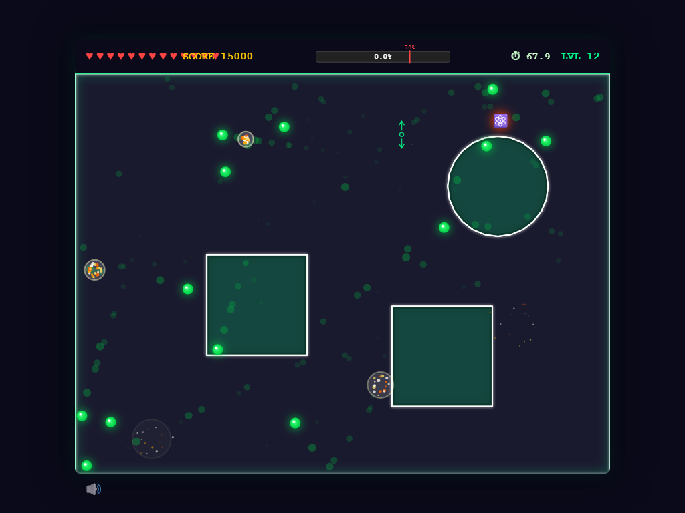
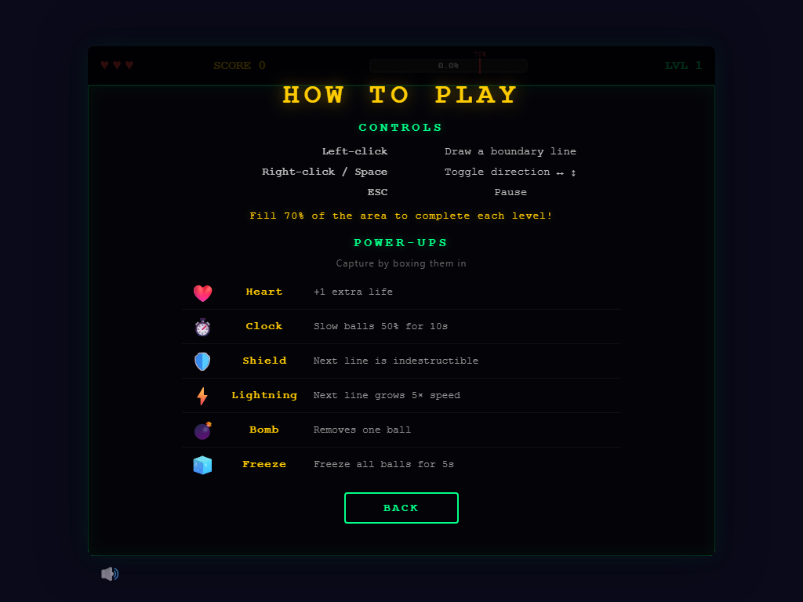

# 🎮 Dave Ball

> **Capture territory, grab power-ups, and avoid the balls!**

An arcade territory-claiming game built with Python and HTML5 Canvas. Draw boundary lines to partition the arena, dodge bouncing balls, and collect 24 different power-ups across endless levels.

### 🤖 Built With

This project was created entirely using [GitHub Copilot CLI](https://docs.github.com/en/copilot) and [Squad](https://github.com/bradygaster/squad) — an AI team orchestration framework that coordinates multiple specialized agents (Ripley 🧠, Dallas 🎨, Ash 🔬, Lambert 📋) to build software collaboratively.



---

## 🕹️ How to Play

| Control | Action |
|---------|--------|
| **Left-click** | Draw a boundary line from your cursor |
| **Right-click / Space** | Toggle line direction (horizontal ↔ vertical) |
| **ESC** | Pause / resume |

- Lines grow from your click point toward the nearest wall or existing boundary
- If a ball hits your **growing** line, you lose a life!
- Completed lines create new walls — enclose regions without balls to **fill** them
- Capture power-ups and fruits by boxing them in with completed lines
- **Fill 70% of the area** to complete each level



### Drawing Lines & Dodging Balls

Click to draw boundary lines that grow toward the nearest wall. Complete lines to claim territory — but don't let a ball hit your growing line!



### Power-ups, Obstacles & Shapes

Higher levels feature obstacle shapes (star, diamond, square, circle, octagon) and power-ups scattered across the arena. Enclose them with your lines to capture their effects.



### Advanced Levels

As you progress, more balls spawn, speeds increase, and multiple obstacles crowd the arena. Strategy matters — plan your lines carefully!



---

## ✨ Features

- 🎯 **24 Power-ups** — Fire, Acid, Snake, Nuke, Shield, Freeze, Portal, and more
- 🍒 **5 Fruit types** — Cherry, Orange, Apple, Grape, Strawberry for bonus points
- 🎨 **5 Color themes** — Default, Neon, Retro, Ocean, Lava
- 🎵 **Procedural audio** — 8-bit music and sound effects via Web Audio API (zero audio files!)
- 🏆 **High score leaderboard** — Compete for the top 10 with 3-letter initials
- 📈 **Endless level progression** — More balls and faster speeds each level
- 🔷 **Obstacle shapes** — Circle, square, triangle, diamond, star, octagon
- 🏎️ **3 Speed settings** — Slow, Normal, Fast
- ⚛️ **Ball physics** — Ball-ball collisions, fission, and rare tunneling
- ✨ **Visual effects** — Rainbow lines, screen shake, fireworks, particle systems

---

## 🔥 Power-ups

Capture power-ups by **enclosing them** with completed boundary lines.

| Icon | Name | Effect |
|:----:|------|--------|
| ❤️ | **Heart** | +1 extra life |
| ⏱️ | **Clock** | Slow all balls 50% for 10s |
| 🛡️ | **Shield** | Next line is indestructible |
| ⚡ | **Lightning** | Next line grows at 5× speed |
| 💣 | **Bomb** | Removes one random ball |
| 🧊 | **Freeze** | Freeze all balls for 5s |
| 🔍 | **Shrink** | Shrink all balls |
| 🔥 | **Fire** | Next line burns balls on contact |
| 🧪 | **Acid** | Spawn acid pools that dissolve balls |
| ☢️ | **Nuke** | Blast radius destroys nearby balls |
| 🐍 | **Snake** | Snake hunts and eats balls |
| 🧲 | **Magnet** | Pull balls toward your cursor |
| ⚓ | **Anchor** | Stop all balls permanently (rare!) |
| 🌀 | **Portal** | Linked portals that teleport balls |
| 🕳️ | **Sinkhole** | Gravity well that pulls in balls |
| 🕸️ | **Web** | Sticky slow zones |
| 〰️ | **Wave** | Balls move in wave patterns |
| 🔗 | **Fusion** | Balls merge on collision |
| ⚛️ | **Fission** | Ball collisions create new balls |
| 🍬 | **Candy** | Bonus points |
| 🎲 | **Mystery** | Random power-up (slot machine reveal!) |
| 💲 | **Jackpot** | Ultra-rare instant level clear |

### ⚠️ Hazards

| Icon | Name | Effect |
|:----:|------|--------|
| ☠️ | **Skull** | Lose a life |
| 🍄 | **Grow** | Makes balls larger and harder to dodge |

---

## 🍒 Bonus Fruits

| Fruit | Points |
|:-----:|-------:|
| 🍒 Cherry | 100 |
| 🍊 Orange | 200 |
| 🍎 Apple | 300 |
| 🍇 Grape | 500 |
| 🍓 Strawberry | 1,000 |

---

## 🚀 Quick Start

### Play Now

The game is hosted on Azure — run `azd env get-values` for the live URL after deploying, or run locally:

### Docker (local)

```bash
docker-compose up
```

Open **http://localhost:8080** and click **"Click to Play"**.

### Manual Setup

```bash
# Backend (Python 3.11+)
cd backend
pip install -r requirements.txt
python app.py
# → runs on http://localhost:5000

# Frontend (any static server)
cd frontend
python -m http.server 8080
# → runs on http://localhost:8080
```

---

## 🏗️ Architecture

**Server-authoritative model** — all game logic runs on the Python backend. The frontend is a pure renderer with no game state.

```
┌───────────────┐  WebSocket (Socket.IO)  ┌─────────────────┐
│   Frontend    │ ◄──────────────────────► │    Backend      │
│ HTML5 Canvas  │    input events          │  Python 3.11    │
│ 60fps render  │    game state @ 30Hz     │  Flask-SocketIO │
└───────────────┘                          └─────────────────┘
```

| Layer | Technology |
|-------|------------|
| **Backend** | Python 3.11, Flask, Flask-SocketIO, eventlet |
| **Frontend** | HTML5 Canvas, vanilla JavaScript (no framework) |
| **Communication** | WebSocket (Socket.IO) |
| **Containers** | Docker, Docker Compose |
| **Hosting** | Azure Container Apps (East US) |
| **Testing** | pytest (229+ tests) |

### Key Backend Modules

| Module | Purpose |
|--------|---------|
| `game_state.py` | Core engine — balls, lines, territory, power-ups, scoring |
| `physics.py` | Ball class, wall/line/ball-ball collision detection |
| `territory.py` | BFS flood fill for enclosed region detection |
| `config.py` | All tunable game constants |
| `app.py` | Flask-SocketIO server, game loop, event handlers |

---

## 🧪 Testing

```bash
# Full suite
python -m pytest tests/ -v

# By marker
python -m pytest -m physics -v
python -m pytest -m territory -v
python -m pytest -m powerups -v
python -m pytest -m scoring -v
```

**229+ tests** covering physics, territory detection, power-ups, scoring, obstacles, snake behavior, and gameplay flows.

Available markers: `physics` · `territory` · `line_growth` · `powerups` · `scoring` · `snake` · `obstacles` · `gameplay` · `coverage` · `slow`

---

## 📂 Project Structure

```
dave-ball/
├── backend/
│   ├── app.py              # Flask-SocketIO server & game loop
│   ├── config.py           # Game constants & balance tuning
│   ├── game_state.py       # Core game engine
│   ├── physics.py          # Ball physics & collision detection
│   ├── territory.py        # BFS flood fill & region detection
│   ├── highscores.py       # High score persistence (JSON)
│   ├── Dockerfile.prod     # Production backend container
│   └── requirements.txt
├── frontend/
│   ├── index.html          # Game page with all UI overlays
│   ├── css/styles.css      # Styling & themes
│   ├── js/
│   │   ├── renderer.js     # Canvas drawing & visual effects
│   │   ├── input.js        # Mouse & keyboard event handling
│   │   ├── interpolation.js # Smooth ball position interpolation
│   │   ├── sound.js        # Procedural audio (Web Audio API)
│   │   └── main.js         # Entry point & Socket.IO setup
│   ├── nginx.conf          # nginx config for local Docker
│   ├── nginx.aca.conf      # nginx config template for Azure (envsubst)
│   ├── Dockerfile.aca      # Azure Container Apps frontend container
│   └── Dockerfile.prod     # Local production frontend container
├── infra/
│   ├── main.bicep          # Azure infrastructure entry point
│   ├── main.parameters.json
│   └── modules/
│       └── resources.bicep # ACR, Container Apps, Storage, Log Analytics
├── tests/                  # 229+ pytest tests
├── azure.yaml              # Azure Developer CLI service config
├── docker-compose.yml      # Local development
├── docker-compose.prod.yml # Local production
└── pyproject.toml
```

---

## 📖 How to Play Screen



---

## 🤝 Contributing

See [CONTRIBUTING.md](CONTRIBUTING.md) for development setup, code style guidelines, and PR checklist.

---

<p align="center">
  Built with Python 🐍 and HTML5 Canvas 🎨 · Powered by <a href="https://docs.github.com/en/copilot">GitHub Copilot CLI</a> and <a href="https://github.com/bradygaster/squad">Squad</a>
</p>
